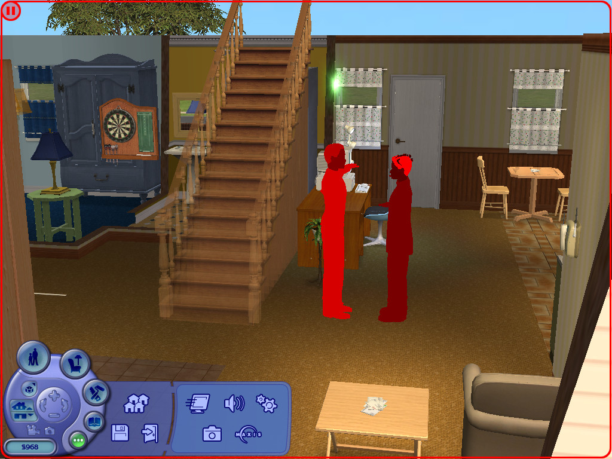
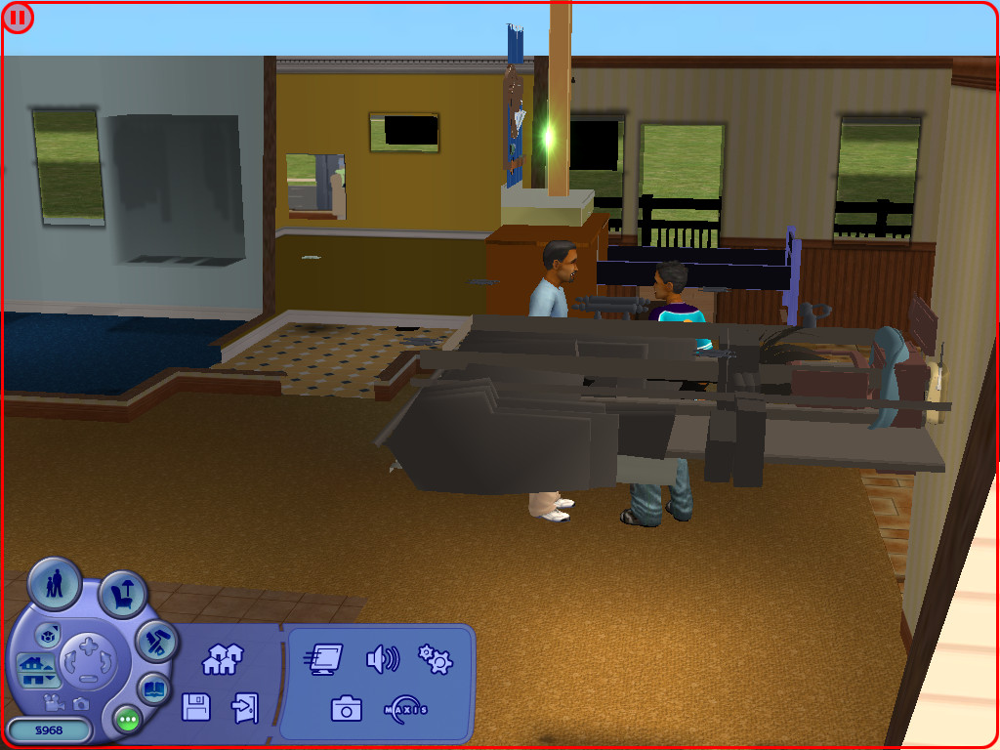
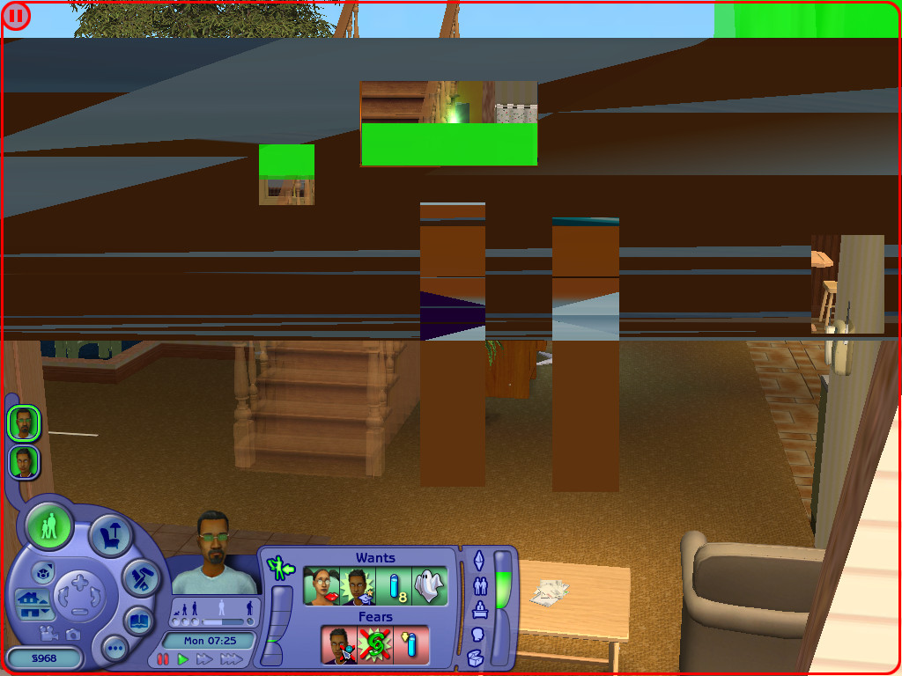
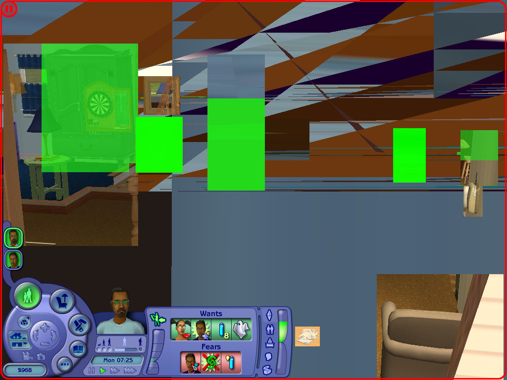
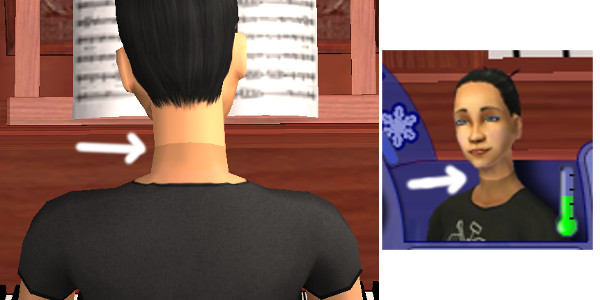

# The Sims 2 Patches for Wine

This repository contains a collection of patches to get The Sims 2 working under
the [Wine Compatibility Layer](https://www.winehq.org/).

## What's this?

The Sims 2 is a classic, but is designed to run on Windows. It has been historically ported to Mac as
[The Sims™ 2: Super Collection](https://www.aspyr.com/games/the-sims-2-super-collection) but
is limited to 6 expansions, 3 stuff packs and hasn't seen any updates in 3+ years.

There are some technical limitations that prevents The Sims 2 from working in Wine,
the most obvious one being **Direct3D returned an error: D3DERR_INVALIDCALL!**.
It's one of the reasons why the game remains
[**Garbage** on AppDB](https://appdb.winehq.org/objectManager.php?sClass=application&iId=1942). Also [voted #6](https://appdb.winehq.org/votestats.php)!

Fear not, as some bug busters have patched the source to investigate the missing
Direct3D features. For players, The Sims 2 starts and is playable with the odd glitch!
For developers, there's some interesting things to uncover. This repository will
maintain the latest copy of Wine with these patches for you to test, debug or play.

## Binaries

See the **[Releases](https://github.com/lah7/sims-2-wine-patches/releases)** page
for the compiled binaries, which can be downloaded and used as-is, or added to
front-ends such as [PlayOnLinux](http://www.playonlinux.com/en) or
[PlayOnMac](http://www.playonmac.com/en).

The binaries are currently compiled without 64-bit support (SysWOW64), meaning they require a 32-bit Wine prefix.

Package     | Compiler OS   | Compiler Arch | Wine Prefix  | Notes |
----------- | ------------- | ------------- | ------------ | ----- | 
`linux-x86` | Ubuntu 16.04  | i386          | 32-bit       |
`mac-x86`   | macOS 10.14.2 | amd64         | 32-bit       | macOS 10.15 will deprecate 32-bit support.

macOS builds are considered experimental.

## Credits

Comment                                                     | Author                | Notes
----------------------------------------------------------- | --------------------- | -----------------
[124](https://bugs.winehq.org/show_bug.cgi?id=8051#c124)    | swswine               | Initial patch and discovery
[160](https://bugs.winehq.org/show_bug.cgi?id=8051#c160)    | Robert Walker         | Updated to Wine 3.5.
[161](https://bugs.winehq.org/show_bug.cgi?id=8051#c161)    | Alexandr Oleynikov    | Updated to Wine 3.7 with staging patches.
[164](https://bugs.winehq.org/show_bug.cgi?id=8051#c164)    | Paul Gofman           | Updated to Wine 3.18, works with newer drivers.

See [bug report 8051 on Wine's bug tracker](https://bugs.winehq.org/show_bug.cgi?id=8051) for development discussions.

## Known Issues & Workarounds

### Hardcoded 256 vertex shaders

The Sims 2 requests 1024 vertex shader constants, but Wine has a hardcoded limit
of 256. Direct3D 9 normally supports up to 8192, using hardware shaders first
(where available), followed by software emulation. Software emulation is currently
not supported in Wine.

### Undocumented or unimplemented D3D9 interfaces

The developers of The Sims 2 used some obscure features of Direct3D 9
as discovered in [the bug report discussion](https://bugs.winehq.org/show_bug.cgi?id=8051#c124).
Some of these will require implementation in Wine which are quite the task:

* Remove hardcoded vertex shader limit - [see D3D9_MAX_VERTEX_SHADER_CONSTANTF in d3d9_private.h](https://github.com/wine-mirror/wine/blob/2ef62f90853d9903cdded2442e382b89a4c3a55f/dlls/d3d9/d3d9_private.h#L43)
  * The game expects at least 1024.
  * *Suggestion:* Via registry?
* [Add ProcessVertices with shader support (#46742)](https://bugs.winehq.org/show_bug.cgi?id=46742)
* [Add support for undocumented Direct3DShaderValidatorCreate9() implementation (#46735)](https://bugs.winehq.org/show_bug.cgi?id=46735)

### Shader Models: 3D Rendering (Early Sims 2 versions only)

Shader Model 2 and Shader Model 3 reveal differences, particularly in the original
release (no patches, no expansions). Newer expansion packs use an improved
rendering engine with fewer differences between SM2 and SM3.

| Shader Model 2 with `useShaders false` | Shader Model 2 with `useShaders true` | Shader Model 3 with `useShaders false` | Shader Model 3 with `useShaders true`
| --- | --- | --- | --- |
|  |  |  | 

The Shader Model version can be set via [Wine's registry](https://wiki.winehq.org/Useful_Registry_Keys):

    HKEY_CURRENT_USER\Software\Wine\Direct3D\MaxShaderModelPS
    HKEY_CURRENT_USER\Software\Wine\Direct3D\MaxShaderModelVS

    REG_DWORD => 2

By opening the cheat console (CTRL+SHIFT+C), you can toggle between parameters
that will effect rendering in-game:

    boolProp useShaders false
    boolProp lightingEnabled false

In order to play earlier versions of the game, you will need to force **Shader Model 2**
via the registry, turn on shaders and disable the lighting engine. Write the following:

    boolProp useShaders true
    boolProp lightingEnabled false

And save to:

    C:\users\<YOURNAME>\My Documents\EA Games\The Sims 2\Config\userStartup.cheat

This is not necessary when using newer versions of the game and expansion packs.
Results may differ on different graphic cards and drivers.

**Note:** Previous Wine patches/binaries mentioned in bug reports and this repository
forced Shader Model 2 in the source code, but this is no longer the case.

### Shader Model 3: Blue Snow

If you have the **Seasons** expansion pack, you may experience blue snow
outside the lot, you can workaround this by forcing Shader Model 2 via the registry.

### Corrupted family thumbnails

The 'red eagle' pose appears on the neighbourhood screen and during loading screens.

The only exception is when a new default neighbourhood is loaded for the first time
in which the thumbnails were already pre-rendered.

This can be fixed by installing a [modified no-censor mod](https://github.com/lah7/sims-2-wine-patches/issues/4)
by @tannisroot. This disables the anti-censoring functionality which happens to fix the thumbnails when saving.

You can [download the mod from their repository](https://github.com/tannisroot/installer-fixes/raw/master/sims2_fixes.tar.xz),
which includes the Sim Shadow Fix mod.

### Skin tone mismatch

A Sims' skin colour may not match between their head and body.

This can be fixed by running this cheat code prior to entering the household:

    boolProp skipTangentsInVertexData true

### Polygon Explosion
Icons above a Sim's head (like the one when you get a new friend) can appear glitchy.

### Black screen after resolution changes (or when minimized)
Changing resolution while in a household can sometimes result in a black screen.

This can be fixed by running this cheat code:

    boolProp createNVidiaWorkaroundTexture false

Alternately, you may set the Wine prefix to run inside a virtual desktop.

### Black boxes for "High" shadows (NVIDIA only)
This also happens under the NVIDIA driver on Windows. This previously did not happen
with earlier versions of the NVIDIA driver (around 396.x and before) and the original
Wine patches.

This can be fixed by installing the [Sim Shadow Fix](http://modthesims.info/d/569585/sim-shadow-fix-updated-2-jan-16.html) (v0.4) mod.

### Huge log files
As the patches expose a lot of FIXMEs in Wine. This can fill up to many
hundreds of MBs, causing potential slowdown.

### Other Notes

* If there are any technical explainations, feel free to create a pull request or issue.
* Please **do not** submit test reports to AppDB when using patched copies of Wine
as the test results do not reflect "vanilla" Wine.
* To view FPS and shader version in-game, press <kbd>CTRL</kbd> + <kbd>SHIFT</kbd> + <kbd>S</kbd>
* There are some engine differences/improvements between the original release,
later expansion packs and the Origin version.

## Workarounds

The aforementioned workarounds are either cheat codes that are entered via the
<kbd>CTRL</kbd> + <kbd>SHIFT</kbd> + <kbd>C</kbd> cheat console while playing, or
saved to this file to run when the game starts:

    C:\users\<YOURNAME>\My Documents\EA Games\The Sims 2\Config\userStartup.cheat

Note that some rendering cheat codes require you to re-enter the household to take effect.

Mods (custom content) are saved in this directory:

    C:\Users\<YOURNAME>\My Documents\EA Games\The Sims 2\Downloads

If you've installed The Sims 2 via [Lutris](https://lutris.net/games/the-sims-2),
these mods are already included.

## Build Instructions

Wine can be built on GNU/Linux and macOS.

1. Clone this repository to acquire the patches.

       git clone https://github.com/lah7/sims-2-wine-patches.git

2. Download a copy of the Wine source code from https://dl.winehq.org/wine/source/

3. Install the dependencies.

    https://wiki.winehq.org/Building_Wine#Satisfying_Build_Dependencies

3. Patch the source and build:

       tar -xvf wine-XXX.tar.bz2
       ln -s wine-XXX a
       patch -p0 < /path/to/file.patch
       cd wine-XXX/
       ./configure --prefix=/path/to/build/
       make install -j4

To speed up compiling, change `-j4` to the number of processor cores you have.

If running via `make` only, you can use the `wine` script to run the build.

## Bug Reports
Developers and hackers, these are the bug reports on WineHQ Bugzilla:

* [8051 - The Sims 2 demo needs support for software vertex processing](https://bugs.winehq.org/show_bug.cgi?id=8051)
* [46735 - The Sims 2 demo needs Direct3DShaderValidatorCreate9() implementation](https://bugs.winehq.org/show_bug.cgi?id=46735)
* [46742 - The Sims 2 demo needs support for ProcessVertices() with software vertex shaders](https://bugs.winehq.org/show_bug.cgi?id=46742)

## External Links
* [YouTube video demonstrating base game under Wine 1.8-rc2 (patched)](https://www.youtube.com/watch?v=j-pFDlEtnC0)
* [YouTube video demonstrating EP9 under Wine 1.8-rc2 (patched)](https://www.youtube.com/watch?v=h9rZPdNLd6I&t=37s)
* [Lutris](https://lutris.net/games/the-sims-2)
* [Lutris - GitHub Wiki](https://github.com/lutris/lutris/wiki/Game:-The-Sims-2) - covers Origin version.
* [WineHQ AppDB - The Sims 2.x](https://appdb.winehq.org/objectManager.php?sClass=version&iId=2633)

## License

Wine is distributed under the [GNU Lesser General Public License 2.1](https://source.winehq.org/source/LICENSE).

