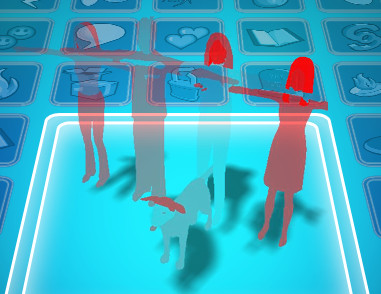
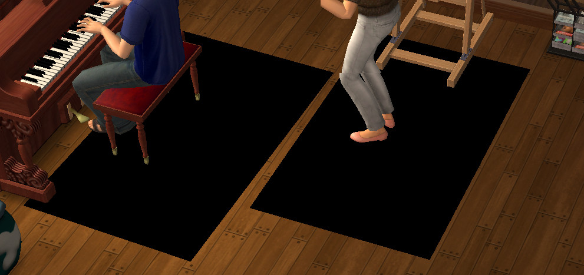

# The Sims 2 Patches for Wine

This repository contains a collection of patches to get The Sims 2 working under
the [Wine Compatibility Layer](https://www.winehq.org/).

## What's this?

The Sims 2 is one of those classics that is highly unlikely to be ported to
another platform.

There are some technical limitations that prevents The Sims 2 from working in Wine,
the most obvious one being **Direct3D returned an error: D3DERR_INVALIDCALL!**.
It's one of the reasons why the game remains
[**Garbage** on AppDB](https://appdb.winehq.org/objectManager.php?sClass=application&iId=1942). Also [voted #6](https://appdb.winehq.org/votestats.php)!

Fear not, as some bug busters have patched the source to enables developers to
investigate the missing Direct3D features, as well as enabling Sims 2 fans to start
the game with some graphical issues. This repository will maintain the latest
copy of Wine with these patches for you to test, debug or play.

## Binaries

See the **[Releases](https://github.com/lah7/sims-2-wine-patches/releases)** page
for the compiled binaries, which can also be imported in front-ends such as
[PlayOnLinux](http://www.playonlinux.com/en).

These are built on **Ubuntu 16.04 (x86)** system, meaning they will only
compatible with a **32-bit Wine prefix**.

## Credits

Comment                                                     | Author                | Notes
----------------------------------------------------------- | --------------------- | -----------------
[124](https://bugs.winehq.org/show_bug.cgi?id=8051#c124     | swswine               | Initial Patch
[160](https://bugs.winehq.org/show_bug.cgi?id=8051#c160)    | Robert Walker         | Updated to Wine 3.5.
[161](https://bugs.winehq.org/show_bug.cgi?id=8051#c161)    | Alexandr Oleynikov    | Updated to Wine 3.7 with staging patches.
[164](https://bugs.winehq.org/show_bug.cgi?id=8051#c164)    | Paul Gofman           | Updated to Wine 3.18, works with newer drivers.

See [bug report 8051 on Wine's bug tracker](https://bugs.winehq.org/show_bug.cgi?id=8051) for development discussions.

## Known Issues

### Hardcoded 256 vertex shaders

The Sims 2 requests 1024 vertex shader constants, but Wine has a hardcoded limit
of 256. Direct3D 9 normally supports up to 8192, using hardware shaders first
(where available), followed by software emulation.

https://github.com/wine-mirror/wine/blob/2ef62f90853d9903cdded2442e382b89a4c3a55f/dlls/d3d9/d3d9_private.h#L43

### Corrupted family thumbnails

The 'red eagle' pose appears on the neighbourhood screen and during loading screens.

The only exception is when a new default neighbourhood is loaded for the first time
in which the thumbnails were already pre-rendered.

### Polygon Explosion

Icons above a Sim's head (like the one when you get a new friend) can appear glitchy.

### Black screen after resolution changes
Changing resolution while at a household can sometimes result in a black screen.

### [NVIDIA only] Black box shadows

This also happens under the NVIDIA driver on Windows. This previously did not happen
with earlier versions of the NVIDIA driver (around 396.x and before) and the original
Wine patches.

### [Wine] Huge log files.

As the patches expose a lot of FIXMEs. If you're running via the terminal;
keeping a log or using PlayOnLinux, beware that this can fill up to many
hundreds of MBs, causing potential slowdown.

### Other Notes

* If there are any other technical explainations or issues, feel free to create a pull request.
* Please **do not** submit test reports to AppDB when using patched copies of Wine
as the test results do not reflect "vanilla" Wine.
* To view FPS and shader version in-game, press <kbd>CTRL</kbd> + <kbd>SHIFT</kbd> + <kbd>S</kbd>
* There are some engine differences/improvements between the original release,
later expansion packs and the Origin version.

## Compile from Source

1. Clone this repository to acquire the patches.

       git clone https://github.com/lah7/sims-2-wine-patches.git

2. Download a copy of the Wine source code from https://dl.winehq.org/wine/source/

       tar -xvf wine-XXX.tar.bz2
       ln -s wine-XXX a
       patch -p0 < /path/to/file.patch
       cd wine-XXX/
       ./configure --prefix=/path/to/build/
       make install -j4

To speed up compiling, change `-j4` to the number of processor cores you have.

#### macOS Support

I haven't compiled for this platform before, but technically, if you install
all the dependencies and then follow these instructions, Wine will be able
to compile and play the game on Mac too.

## External Links

* [YouTube video demonstrating base game under Wine 1.8-rc2 (patched)](https://www.youtube.com/watch?v=j-pFDlEtnC0)
* [YouTube video demonstrating EP9 under Wine 1.8-rc2 (patched)](https://www.youtube.com/watch?v=h9rZPdNLd6I&t=37s)
* [Lutris](https://lutris.net/games/the-sims-2)
* [Lutris - GitHub Wiki](https://github.com/lutris/lutris/wiki/Game:-The-Sims-2) - covers Origin version

## License

Wine is distributed under the [GNU Lesser General Public License 2.1](https://source.winehq.org/source/LICENSE).

